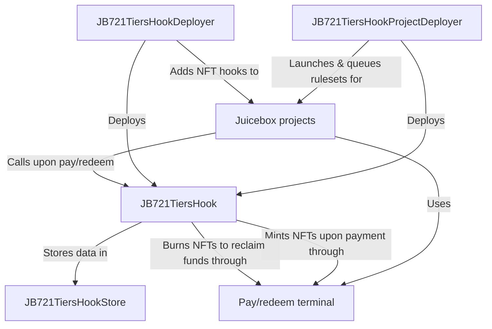

# Bananapus NFT Hook

`nana-721-hook` is:

1. A pay hook for Juicebox projects to sell tiered NFTs (ERC-721s) with different prices and artwork.
2. (Optionally) a redeem hook which allows holders to burn their NFTs to reclaim funds from the project, in proportion to the NFT's price.

<details>
  <summary>Table of Contents</summary>
  <ol>
    <li><a href="#usage">Usage</a></li>
  <ul>
    <li><a href="#install">Install</a></li>
    <li><a href="#develop">Develop</a></li>
    <li><a href="#scripts">Scripts</a></li>
    <li><a href="#deployments">Deployments</a></li>
    <ul>
      <li><a href="#with-sphinx">With Sphinx</a></li>
      <li><a href="#without-sphinx">Without Sphinx</a></li>
      </ul>
    <li><a href="#tips">Tips</a></li>
    </ul>
    <li><a href="#repository-layout">Repository Layout</a></li>
    <li><a href="#architecture">Architecture</a></li>
  <ul>
    <li><a href="#contracts">Contracts</a></li>
    </ul>
    <li><a href="#description">Description</a></li>
  <ul>
    <li><a href="#hooks">Hooks</a></li>
    <li><a href="#mechanism">Mechanism</a></li>
    <li><a href="#setup">Setup</a></li>
    </ul>
  </ul>
  </ol>
</details>

_If you're having trouble understanding this contract, take a look at the [core protocol contracts](https://github.com/Bananapus/nana-core) and the [documentation](https://docs.juicebox.money/) first. If you have questions, reach out on [Discord](https://discord.com/invite/ErQYmth4dS)._

## Usage

### Install

How to install `nana-721-hook` in another project.

For projects using `npm` to manage dependencies (recommended):

```bash
npm install @bananapus/721-hook
```

For projects using `forge` to manage dependencies (not recommended):

```bash
forge install Bananapus/nana-721-hook
```

If you're using `forge` to manage dependencies, add `@bananapus/721-hook/=lib/nana-721-hook/` to `remappings.txt`. You'll also need to install `nana-721-hook`'s dependencies and add similar remappings for them.

### Develop

`nana-721-hook` uses [npm](https://www.npmjs.com/) (version >=20.0.0) for package management and the [Foundry](https://github.com/foundry-rs/foundry) development toolchain for builds, tests, and deployments. To get set up, [install Node.js](https://nodejs.org/en/download) and install [Foundry](https://github.com/foundry-rs/foundry):

```bash
curl -L https://foundry.paradigm.xyz | sh
```

You can download and install dependencies with:

```bash
npm ci && forge install
```

If you run into trouble with `forge install`, try using `git submodule update --init --recursive` to ensure that nested submodules have been properly initialized.

Some useful commands:

| Command               | Description                                         |
| --------------------- | --------------------------------------------------- |
| `forge build`         | Compile the contracts and write artifacts to `out`. |
| `forge fmt`           | Lint.                                               |
| `forge test`          | Run the tests.                                      |
| `forge build --sizes` | Get contract sizes.                                 |
| `forge coverage`      | Generate a test coverage report.                    |
| `foundryup`           | Update foundry. Run this periodically.              |
| `forge clean`         | Remove the build artifacts and cache directories.   |

To learn more, visit the [Foundry Book](https://book.getfoundry.sh/) docs.

### Scripts

For convenience, several utility commands are available in `package.json`.

| Command             | Description                                             |
| ------------------- | ------------------------------------------------------- |
| `npm test`          | Run local tests.                                        |
| `npm run coverage`  | Generate an LCOV test coverage report.                  |
| `npm run artifacts` | Fetch Sphinx artifacts and write them to `deployments/` |

### Deployments

#### With Sphinx

`nana-721-hook` manages deployments with [Sphinx](https://www.sphinx.dev). To run the deployment scripts, install the npm `devDependencies` with:

```bash
`npm ci --also=dev`
```

You'll also need to set up a `.env` file based on `.example.env`. Then run one of the following commands:

| Command                   | Description                  |
| ------------------------- | ---------------------------- |
| `npm run deploy:mainnets` | Propose mainnet deployments. |
| `npm run deploy:testnets` | Propose testnet deployments. |

Your teammates can review and approve the proposed deployments in the Sphinx UI. Once approved, the deployments will be executed.

#### Without Sphinx

You can use the Sphinx CLI to run the deployment scripts without paying for Sphinx. First, install the npm `devDependencies` with:

```bash
`npm ci --also=dev`
```

You can deploy the contracts like so:

```bash
PRIVATE_KEY="0x123..." RPC_ETHEREUM_SEPOLIA="https://rpc.ankr.com/eth_sepolia" npx sphinx deploy script/Deploy.s.sol --network ethereum_sepolia
```

This example deploys `nana-721-hook` to the Sepolia testnet using the specified private key. You can configure new networks in `foundry.toml`.

### Tips

To view test coverage, run `npm run coverage` to generate an LCOV test report. You can use an extension like [Coverage Gutters](https://marketplace.visualstudio.com/items?itemName=ryanluker.vscode-coverage-gutters) to view coverage in your editor.

If you're using Nomic Foundation's [Solidity](https://marketplace.visualstudio.com/items?itemName=NomicFoundation.hardhat-solidity) extension in VSCode, you may run into LSP errors because the extension cannot find dependencies outside of `lib`. You can often fix this by running:

```bash
forge remappings >> remappings.txt
```

This makes the extension aware of default remappings.

## Repository Layout

The root directory contains this README, an MIT license, and config files. The important source directories are:

```
nana-721-hook/
├── script/
│   ├── Deploy.s.sol - Deploys core contracts - the hook store, deployer, and project deployer.
│   ├── LaunchProjectFor.s.sol - (DEPRECATED) Deploys a project with a 721 tiers hook.
│   └── helpers/
│       └── Hook721DeploymentLib.sol - Internal helpers for deployment scripts.
├── src/ - Contract source code. Top level contains implementation contracts.
│   ├── JB721TiersHook.sol - The core tiered NFT pay/redeem hook.
│   ├── JB721TiersHookDeployer.sol - Deploys an NFT hook for a project.
│   ├── JB721TiersHookProjectDeployer.sol - Deploys a project with a tiered NFT hook.
│   ├── JB721TiersHookStore.sol - Stores and manages data for tiered NFT hooks.
│   ├── abstract/
│   │   ├── ERC721.sol - Abstract ERC-721 implementation.
│   │   └── JB721Hook.sol - Abstract NFT hook implementation.
│   ├── interfaces/ - Contract interfaces.
│   ├── libraries/ - Libraries.
│   └── structs/ - Structs.
└── test/ - Forge tests and testing utilities.
    ├── E2E/
    │   └── Pay_Mint_Redeem_E2E.t.sol - End-to-end test for minting and redeeming NFTs.
    ├── unit/ - Unit tests for various components..
    └── utils/ - Miscellaneous testing utilities.
```

Other directories:

```
nana-721-hook/
├── .github/
│   └── workflows/ - CI/CD workflows.
└── deployments/ - Sphinx deployment logs.
```

## Architecture



### Contracts

| Contract                                                                                                                          | Description                                                                                             |
| --------------------------------------------------------------------------------------------------------------------------------- | ------------------------------------------------------------------------------------------------------- |
| [`JB721TiersHook.sol`](https://github.com/Bananapus/nana-721-hook/blob/main/src/JB721TiersHook.sol)                               | The core tiered NFT pay/redeem hook implementation.                                                     |
| [`JB721TiersHookDeployer.sol`](https://github.com/Bananapus/nana-721-hook/blob/main/src/JB721TiersHookDeployer.sol)               | Exposes a `deployHookFor(…)` function which allows deploys an NFT hook for a project.                   |
| [`JB721TiersHookProjectDeployer.sol`](https://github.com/Bananapus/nana-721-hook/blob/main/src/JB721TiersHookProjectDeployer.sol) | Exposes a `launchProjectFor(…)` function which deploys a project with a tiered NFT hook already set up. |
| [`JB721TiersHookStore.sol`](https://github.com/Bananapus/nana-721-hook/blob/main/src/JB721TiersHookStore.sol)                     | Stores and manages data for tiered NFT hooks.                                                           |

## Description

### Hooks

This contract is a _data hook_, a _pay hook_, and a _redeem hook_. Data hooks receive information about a payment or a redemption, and put together a payload for the pay/redeem hook to execute.

Juicebox projects can specify a data hook in their `JBRulesetMetadata`. When someone attempts to pay or redeem from the project, the project's terminal records the payment in the terminal store, passing information about the payment/redemption to the data hook in the process. The data hook responds with a list of payloads – each payload specifies the address of a pay/redeem hook, as well as some custom data and an amount of funds to send to that pay/redeem hook.

Each pay/redeem hook can then execute custom behavior based on the custom data (and funds) they receive.

### Mechanism

A project using a 721 tiers hook can specify any number of NFT tiers.

- NFT tiers can be removed by the project owner as long as they are not locked.
- NFT tiers can be added by the project owner as long as they respect the hook's `flags`. The flags specify if newly added tiers can have votes (voting units), if new tiers can have non-zero reserve frequencies, if new tiers can allow on-demand minting by the project's owner, and if the tier can be removed.

Each tier has the following optional properties:

- A price.
- A supply (the maximum number of NFTs which can be minted from the tier).
- A token URI (artwork and metadata), which can be overridden by a URI resolver. The URI resolver can return unique values for each NFT in the tier.
- A category, so tiers can be organized and accessed for different purposes.
- A reserve frequency (optional). With a reserve frequency of 5, an extra NFT will be minted to a pre-specified beneficiary address for every 5 NFTs purchased and minted from the tier.
- A number of votes each NFT should represent on-chain (optional).
- A flag to specify whether the NFTs in the tier can always be transferred, or if transfers can be paused depending on the project's ruleset.
- A flag to specify whether the contract's owner can mint NFTs from the tier on-demand.
- A set of flags which restrict tiers added in the future (the votes/reserved frequency/on-demand minting/can be removed flags noted above).

Additional notes:

- A payer can specify any number of tiers to mint as long as the total price does not exceed the amount being paid. If tiers aren't specified, their payment mints the most expensive tier possible, unless they specify that the hook should not mint any NFTs.
- If the payment and a tier's price are specified in different currencies, the `JBPrices` contract is used to normalize the values.
- If some of a payment does not go towards purchasing an NFT, those extra funds will be stored as "NFT credits" which can be used for future purchases. Optionally, the hook can disallow credits and reject payments with leftover funds.
- If enabled by the project owner, holders can burn their NFTs to reclaim funds from the project. These redemptions are proportional to the NFTs price, relative to the combined price of all the NFTs.
- NFT redemptions can be enabled by setting `useDataHookForRedeem` to `true` in the project's `JBRulesetMetadata`. If NFT redemptions are enabled, project token redemptions are disabled.
- The hook's deployer can choose if the NFTs should support on-chain voting (as `ERC721Votes`). This increases the gas fees to interact with the NFTs, and should be disabled if not needed.

### Setup

To use a 721 tiers hook, a Juicebox project should be created by a `JB721TiersHookProjectDeployer` instead of a `JBController`. The deployer will create a `JB721TiersHook` (through an associated `JB721TiersHookDeployer`) and add it to the project's first ruleset. New rulesets can be queued with `JB721TiersHookProjectDeployer.queueRulesetsOf(…)` if the project's owner gives the project deployer the permission [`JBPermissions.QUEUE_RULESETS`](https://github.com/Bananapus/nana-permission-ids/blob/master/src/JBPermissionIds.sol) (ID `2`) in [`JBPermissions`](https://github.com/Bananapus/nana-core/blob/main/src/JBPermissions.sol).

It's also possible to add a 721 tiers hook to an existing project by calling `JB721TiersHookDeployer.deployHookFor(…)` and adding the hook to the project's ruleset – specifically, the project must set their [`JBRulesetMetadata.dataHook`](https://github.com/Bananapus/nana-core/blob/main/src/structs/JBRulesetMetadata.sol) to the newly deployed hook, and enable `JBRulesetMetadata.useDataHookForPay` and/or `JBRulesetMetadata.useDataHookForRedeem` depending on the functionality they'd like to enable.

All `JB721TiersHook`s store their data in the `JB721TiersHookStore` contract.
